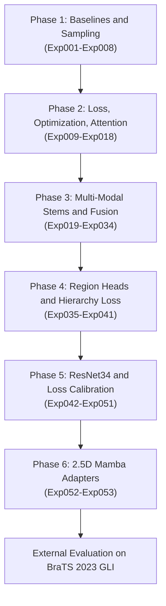
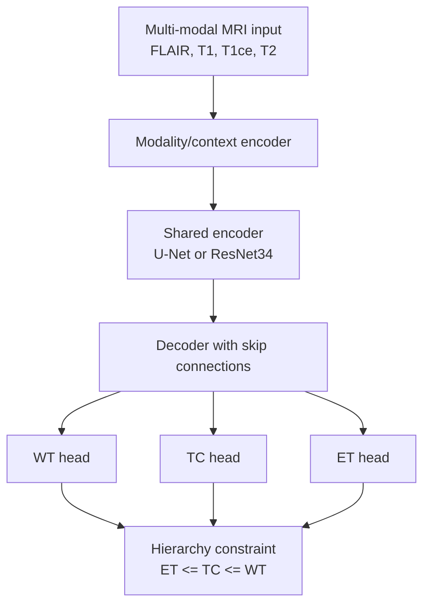

# Multi-Modal Brain Tumor Segmentation on BraTS 2020

> A 53-experiment study for multi-modal MRI brain tumor segmentation, trained on BraTS 2020 and externally evaluated on BraTS 2023 GLI.

<p align="center">
  
  
  
  
  
</p>

## Overview

This repository contains the code and experiment configurations for a graduation thesis on automatic brain tumor segmentation from multi-modal MRI. The project studies 2D and 2.5D segmentation pipelines using FLAIR, T1, T1ce, and T2 MRI modalities.

The main training benchmark is BraTS 2020. The best trained model is then evaluated directly on BraTS 2023 GLI to test external generalization without fine-tuning.

**Thesis topic:** Phân đoạn khối u não đa phương thái trên ảnh cộng hưởng từ MRI sử dụng mô hình kết hợp Mamba và ràng buộc phân cấp giải phẫu.

## Key Contributions

- **53 reproducible YAML configurations:** experiments are organized from `configs/exp001.yaml` to `configs/exp053.yaml`.
- **Progressive model design:** baseline U-Net, Attention U-Net, multi-modal fusion, region-specific heads, ResNet34 encoder, and 2.5D Mamba adapters.
- **Region-hierarchy consistency:** the model can enforce the anatomical relation `ET <= TC <= WT` through a differentiable hierarchy loss.
- **External validation:** the strongest BraTS 2020 checkpoint is evaluated on 1,251 BraTS 2023 GLI cases.

## Table of Contents

- [Quickstart](#quickstart)
- [Dataset Setup](#dataset-setup)
- [Project Structure](#project-structure)
- [Terminology and Metrics](#terminology-and-metrics)
- [Experiment Roadmap](#experiment-roadmap)
- [Model Design](#model-design)
- [Results](#results)
- [Usage](#usage)
- [Scripts](#scripts)
- [Reproducibility Notes](#reproducibility-notes)
- [Limitations](#limitations)
- [Citation and License](#citation-and-license)

## Quickstart

```bash
git clone https://github.com/DucPh4t/BraTS-Brain-Tumor-Segmentation.git
cd BraTS-Brain-Tumor-Segmentation

python3 -m venv venv
source venv/bin/activate

pip install --upgrade pip
pip install -r requirements.txt

# Edit data.root_dir in the selected YAML config before training.
python main.py --config configs/exp043.yaml --mode train

# Run evaluation after a checkpoint has been created.
python main.py --config configs/exp043.yaml --mode eval
```

For Windows PowerShell:

```powershell
python -m venv venv
.\venv\Scripts\Activate.ps1
python -m pip install --upgrade pip
pip install -r requirements.txt
```

For Mamba-based experiments (`exp052`, `exp053`) on NVIDIA CUDA environments such as Linux, Kaggle, or Colab:

```bash
pip install -r requirements-mamba.txt --no-build-isolation
```

## Dataset Setup

BraTS datasets are not included in this repository because they require official access and separate dataset terms. Download the datasets from the official BraTS distribution channels, then place or mount them locally.

Expected layout:

```text
data/
  BraTS2020/
    BraTS20_Training_001/
      BraTS20_Training_001_flair.nii.gz
      BraTS20_Training_001_t1.nii.gz
      BraTS20_Training_001_t1ce.nii.gz
      BraTS20_Training_001_t2.nii.gz
      BraTS20_Training_001_seg.nii.gz
    ...
  BraTS2023_GLI/
    BraTS-GLI-00000-000/
      BraTS-GLI-00000-000-t2f.nii.gz
      BraTS-GLI-00000-000-t1n.nii.gz
      BraTS-GLI-00000-000-t1c.nii.gz
      BraTS-GLI-00000-000-t2w.nii.gz
      BraTS-GLI-00000-000-seg.nii.gz
    ...
```

In Kaggle, either edit `data.root_dir` in the YAML config or replace the `KAGGLE_PATH` placeholder with the mounted dataset path, for example:

```yaml
data:
  root_dir: "/kaggle/input/brats2020-training-data/MICCAI_BraTS2020_TrainingData"
```

## Project Structure

```text
.
├── configs/                  # 53 experiment YAML files
├── main.py                   # Train/eval entry point
├── scripts/                  # Evaluation, plotting, visualization, and audit tools
├── src/
│   ├── data/                 # BraTS dataset loaders and preprocessing
│   ├── engine/               # Training and evaluation loops
│   ├── models/               # U-Net, Attention U-Net, ResNet U-Net, Mamba U-Net
│   └── utils/                # Metrics, losses, post-processing, provenance
├── outputs/                  # Local training outputs, checkpoints, and figures
├── requirements.txt
├── requirements-mamba.txt
└── LICENSE
```

## Terminology and Metrics

### Tumor subregions

For BraTS 2020:

- **WT - Whole Tumor:** labels `1 + 2 + 4`
- **TC - Tumor Core:** labels `1 + 4`
- **ET - Enhancing Tumor:** label `4`

For BraTS 2023 GLI, label naming and filenames may differ from BraTS 2020. This repository handles BraTS 2023 through the dedicated dataset/evaluation code in [src/data/dataset_brats2023.py](src/data/dataset_brats2023.py) and [scripts/evaluate_brats2023.py](scripts/evaluate_brats2023.py).

### Metrics

Dice Similarity Coefficient:

$$
\text{Dice}(P, G) = \frac{2 |P \cap G|}{|P| + |G|}
$$

Hausdorff Distance 95th Percentile (HD95) measures boundary error in millimeters using the 95th percentile of surface distances.

## Experiment Roadmap



| Phase | Experiments | Main idea | Representative result |
| :--- | :--- | :--- | :--- |
| Baselines and sampling | `exp001`-`exp008` | 2D U-Net, normalization, fixed/weighted/oversampled slices | `exp004` reached 84.17% mean Dice |
| Loss and attention | `exp009`-`exp018` | Dice+BCE, AdamW, Attention U-Net | `exp018` reached 84.07% mean Dice |
| Multi-modal fusion | `exp019`-`exp034` | Modality-specific stems and shared/private fusion | `exp023` reached 85.15% mean Dice with TTA |
| Region hierarchy | `exp035`-`exp041` | WT/TC/ET heads and hierarchy consistency | `exp036` reached 85.25% mean Dice |
| ResNet34 trunk | `exp042`-`exp051` | ResNet34 encoder, hierarchy heads, calibration, cleanup | `exp043` reached 85.51% mean Dice |
| Mamba adapters | `exp052`-`exp053` | 2.5D context modeling with Mamba at/near the bottleneck | `exp052` reached 84.32% mean Dice |

## Model Design

The strongest conventional model in this study is `exp043`, a ResNet34 region-heads U-Net with hierarchy consistency. The more exploratory branch is `exp052`/`exp053`, which adds a lightweight 2.5D Mamba adapter to model context across adjacent axial slices.



Hierarchy loss:

$$
\mathcal{L}_{\text{hier}} =
\frac{1}{N} \sum_{i=1}^{N}
\left[
\max(0, P_{\text{ET}, i} - P_{\text{TC}, i}) +
\max(0, P_{\text{TC}, i} - P_{\text{WT}, i})
\right]
$$

Total loss:

$$
\mathcal{L}_{\text{total}} =
w_{\text{dice}}\mathcal{L}_{\text{Dice}} +
w_{\text{bce}}\mathcal{L}_{\text{BCE}} +
w_{\text{hier}}\mathcal{L}_{\text{hier}}
$$

## Results

### BraTS 2020 evaluation

| Model Architecture | Config | WT Dice | TC Dice | ET Dice | Mean Dice |
| :--- | :---: | :---: | :---: | :---: | :---: |
| Baseline 2D U-Net | `exp001` | 0.8546 | 0.8039 | 0.7847 | 0.8144 |
| Attention U-Net 2D | `exp018` | 0.9047 | 0.8440 | 0.7733 | 0.8407 |
| Disentangled 2D Fusion | `exp021` | 0.9100 | 0.8562 | 0.7821 | 0.8494 |
| Region Heads + Hierarchy Consistency | `exp036` | 0.9098 | 0.8592 | 0.7884 | 0.8525 |
| ResNet34 Region-Heads U-Net | `exp043` | **0.9081** | **0.8642** | **0.7929** | **0.8551** |
| Hybrid 2.5D Mamba Residual Adapter | `exp052` | 0.9017 | 0.8514 | 0.7766 | 0.8432 |

### External evaluation on BraTS 2023 GLI

The `exp043` checkpoint was trained on BraTS 2020 and evaluated directly on 1,251 BraTS 2023 GLI cases without fine-tuning.

| Dataset / Benchmark | WT Dice | TC Dice | ET Dice | Mean Dice | WT HD95 | TC HD95 | ET HD95 | Mean HD95 |
| :--- | :---: | :---: | :---: | :---: | :---: | :---: | :---: | :---: |
| BraTS 2020 configured test split | 0.9081 | 0.8642 | 0.7929 | 0.8551 | 6.20 mm | 4.49 mm | 21.84 mm | 10.84 mm |
| BraTS 2023 GLI zero-shot | **0.9017** | **0.8725** | **0.8261** | **0.8668** | **10.00 mm** | **9.15 mm** | **12.47 mm** | **10.54 mm** |
| Delta | -0.0064 | +0.0083 | +0.0332 | +0.0117 | +3.80 mm | +4.66 mm | -9.37 mm | -0.30 mm |

These numbers should be interpreted with the exact preprocessing, checkpoint, thresholding, and post-processing settings used by the corresponding config and evaluation script.

### Visualizations

<p align="center">
  
  
</p>

## Usage

### Train a model

```bash
python main.py --config configs/exp043.yaml --mode train
```

On Kaggle, use `--stop_epoch` to save before a session timeout, then resume from the last checkpoint in a later session:

```bash
python main.py --config configs/exp043.yaml --mode train --stop_epoch 10
python main.py --config configs/exp043.yaml --mode train --resume_path outputs/exp043/last_checkpoint.pth
```

### Resume training

```bash
python main.py --config configs/exp043.yaml --mode train --resume_path outputs/exp043/last_checkpoint.pth
```

### Evaluate on the configured BraTS 2020 split

```bash
python main.py --config configs/exp043.yaml --mode eval
```

### Evaluate on BraTS 2023 GLI

```bash
python scripts/evaluate_brats2023.py \
  --checkpoint outputs/exp043/best_model.pth \
  --config configs/exp043.yaml \
  --dataset_root /path/to/BraTS2023_GLI
```

### Plot training curves

```bash
python scripts/plot_training_curves.py
```

### Visualize predictions

```bash
python scripts/visualize_best_cases.py
python scripts/visualize_hard_cases.py
python scripts/visualize_outliers.py
```

## Scripts

| Script | Purpose |
| :--- | :--- |
| [scripts/evaluate_brats2023.py](scripts/evaluate_brats2023.py) | Evaluate a trained checkpoint on BraTS 2023 GLI. |
| [scripts/plot_training_curves.py](scripts/plot_training_curves.py) | Plot training history curves from experiment outputs. |
| [scripts/visualize_best_cases.py](scripts/visualize_best_cases.py) | Visualize high-performing segmentation cases. |
| [scripts/visualize_hard_cases.py](scripts/visualize_hard_cases.py) | Inspect difficult cases and failure modes. |
| [scripts/visualize_outliers.py](scripts/visualize_outliers.py) | Generate outlier visualizations. |
| [scripts/audit_brats_overlap.py](scripts/audit_brats_overlap.py) | Check possible subject identifier overlap between BraTS datasets. |
| [scripts/download_brats2023.py](scripts/download_brats2023.py) | Helper script for BraTS 2023 data preparation when access is available. |

## Reproducibility Notes

- Set the dataset path in each config before training. Many configs use `KAGGLE_PATH` as a placeholder.
- Large datasets and model weights are not included in the repository.
- Checkpoints under `outputs/` are local experiment artifacts and may be ignored by Git depending on file type.
- The reported results depend on the exact config, seed, split, preprocessing, thresholds, and post-processing settings.
- For Mamba experiments, CUDA package compatibility is important. Use `requirements-mamba.txt` and verify the installed PyTorch/CUDA versions.

## Limitations

- Most experiments are 2D or 2.5D rather than full 3D, which reduces memory cost but may lose some volumetric context.
- BraTS 2023 GLI is used for external validation; performance should not be interpreted as a replacement for a fully controlled multi-center test protocol.
- HD95 can be highly sensitive to tiny false-positive or false-negative regions, especially for ET.
- Kaggle session time limits may require checkpoint resume or shorter slice ranges for large experiment sweeps.

## Citation and License

This project is released under the [MIT License](LICENSE).

If this repository is useful for your work, please cite:

```bibtex
@misc{nguyen_brats_53exp_2026,
  author = {Nguyen Duc Phat},
  title = {Multi-Modal Brain Tumor Segmentation on BraTS 2020 and BraTS 2023 with Region-Hierarchy Consistency and 2.5D Mamba Adapters},
  year = {2026},
  publisher = {GitHub},
  howpublished = {\url{https://github.com/DucPh4t/BraTS-Brain-Tumor-Segmentation}}
}
```
