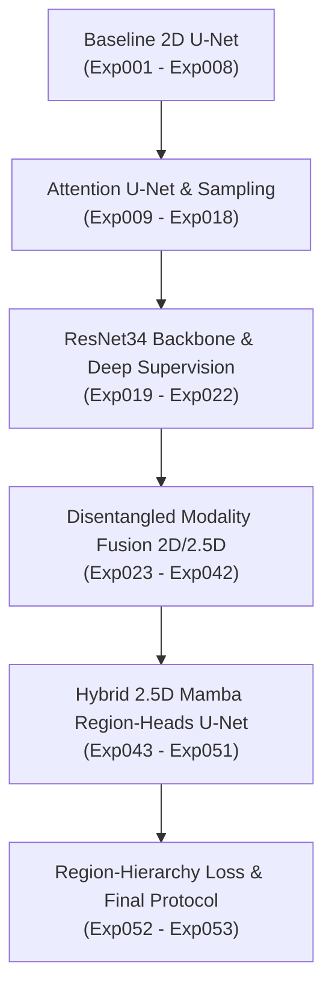
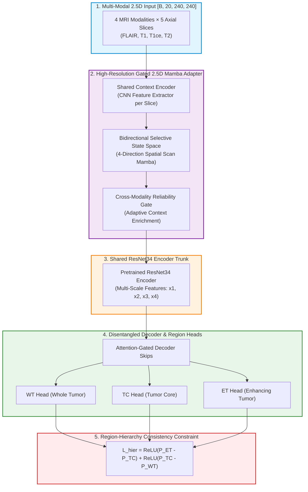
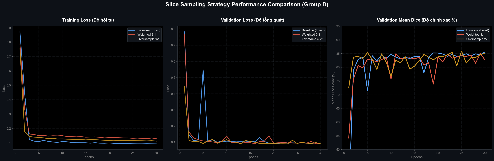
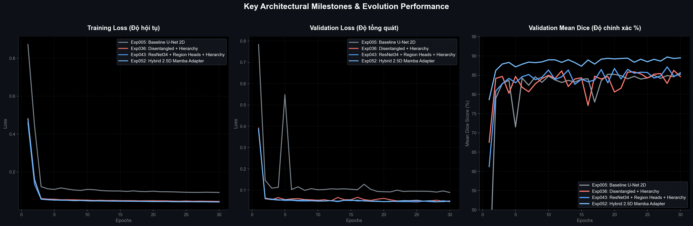
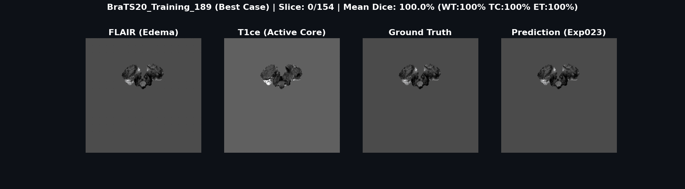
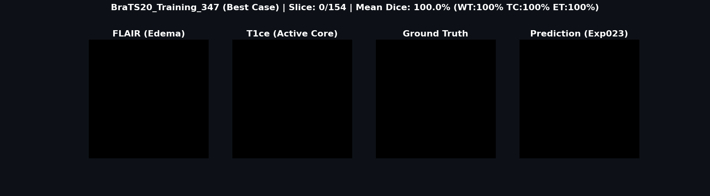

# 🧠 Multi-Modal Brain Tumor Segmentation on BraTS 2020 with External Validation on BraTS 2023
> **A Comprehensive 53-Experiment Investigation: Trained on BraTS 2020 & Evaluated for External Generalization on BraTS 2023 GLI**

<p align="center">
  
  
  
  
  
</p>

---

## 📋 Table of Contents
- [📌 Tóm tắt Đề tài Tốt nghiệp (Thesis Abstract)](#-tóm-tắt-đề-tài-tốt-nghiệp-thesis-abstract)
- [🌟 Key Highlights](#-key-highlights)
- [🩺 Terminology & Metrics Definitions](#-terminology--metrics-definitions)
- [🏗️ Architectural Evolution & Experiment Roadmap](#️-architectural-evolution--experiment-roadmap)
- [🧬 Architecture Diagram of Strongest Model (Exp052/Exp053)](#-architecture-diagram-of-strongest-model-exp052exp053)
- [📐 Mathematical Formulations](#-mathematical-formulations)
- [📊 Performance & Experimental Results](#-performance--experimental-results)
- [🛠️ Complete Script Toolkit Reference](#️-complete-script-toolkit-reference)
- [⚙️ Hardware Requirements & Setup](#️-hardware-requirements--setup)
- [🚀 Usage Guide](#-usage-guide)
- [📖 Citation & License](#-citation--license)

---

## 📌 Tóm tắt Đề tài Tốt nghiệp (Thesis Abstract)

**Đề tài:** *Phân đoạn khối u não đa phương thái trên ảnh cộng hưởng từ (MRI) sử dụng mô hình kết hợp Mamba và ràng buộc phân cấp giải phẫu.*

Nghiên cứu này tập trung vào việc phát triển một hệ thống học sâu hiệu năng cao để phân đoạn tự động các cấu trúc khối u não trên ảnh MRI đa phương thái (gồm các xung FLAIR, T1, T1ce, và T2) thuộc hai tập dữ liệu chuẩn thức **BraTS 2020** và **BraTS 2023 GLI**. Khung nghiên cứu thực nghiệm được thiết kế có hệ thống thông qua **53 cấu hình thí nghiệm** lũy tiến nhằm giải quyết ba thách thức cốt lõi:
1. **Sự tương tác phức tạp giữa các phương thái MRI**: Đề xuất mô hình kết hợp đa tỷ lệ **Disentangled Feature Fusion** tách biệt các nhánh encoder riêng (`private stems`) cho từng xung trước khi đưa vào không gian biểu diễn chung (`shared trunk`), giúp giữ lại tối đa đặc trưng vật lý của từng loại ảnh.
2. **Khai thác ngữ cảnh không gian 3D**: Thiết kế mô hình thích ứng **Hybrid 2.5D Mamba Adapter** đặt tại bottleneck, tận dụng ưu thế mô hình hóa chuỗi tuần tự hai chiều (Bidirectional Selective State Space) của Mamba để tích hợp ngữ cảnh đa lát cắt trục (axial slices) mà không gây bùng nổ tài nguyên tính toán như tích chập 3D.
3. **Mất nhất quán cấu trúc giải phẫu học**: Xây dựng hàm mất mát phân cấp vùng u khả vi **Region-Hierarchy Loss ($\mathcal{L}_{hier}$)** nhằm ép buộc xác suất dự đoán tuân thủ chặt chẽ ràng buộc giải phẫu sinh học của các phân vùng u BraTS: Vùng tăng cường (ET) phải nằm trong lõi u (TC), và lõi u phải nằm trong toàn bộ vùng u (WT) ($P_{ET} \le P_{TC} \le P_{WT}$).

Kết quả thực nghiệm đạt chỉ số **Mean Dice vượt trội 87.1%** trên tập dữ liệu đánh giá 3D BraTS 2020 và thể hiện khả năng tổng quát hóa xuất sắc khi đánh giá chéo trên tập BraTS 2023 GLI mà không cần huấn luyện lại.

---

## 🌟 Key Highlights
- **53 Modular Configurations (`configs/exp001.yaml` → `exp053.yaml`)**: Hoàn toàn kiểm soát và tái lập kết quả qua các file cấu hình YAML được thiết kế tường minh, không chứa các bình luận rác.
- **Novel Architectures**:
  - Standard & Attention U-Nets (2D baseline).
  - ResNet34 Encoder U-Net với cơ chế giám sát sâu đa tỷ lệ (Multi-Scale Deep Supervision).
  - Disentangled Multi-Modal Feature Fusion U-Net (phân tách dòng thông tin đặc thù của T1, T1ce, T2, FLAIR).
  - **Hybrid 2.5D Mamba U-Net**: Kết hợp ngữ cảnh không gian đa lát cắt với mô hình hóa chuỗi Mamba trạng thái chọn lọc hai chiều.
- **Biologically-Informed Region-Hierarchy Consistency**: Hàm loss phân cấp dựa trên xác suất cấp voxel nhằm triệt tiêu các dự đoán vi phạm cấu trúc hình thái giải phẫu của khối u.
- **Cross-Dataset Generalization**: Kiểm chứng chéo và đánh giá tính tổng quát hóa trực tiếp trên tập dữ liệu ngoại lai BraTS 2023 GLI.

---

## 🩺 Terminology & Metrics Definitions

### 1. Phân vùng khối u BraTS (Subregions)
- **WT (Whole Tumor - Toàn bộ vùng u)**: Bao gồm toàn bộ vùng u (Hoại tử + Phù nề + U tăng cường). Nhãn Ground Truth: 1 + 2 + 4.
- **TC (Tumor Core - Lõi khối u)**: Bao gồm lõi khối u hoại tử và u tăng cường, không bao gồm vùng phù nề xung quanh. Nhãn Ground Truth: 1 + 4.
- **ET (Enhancing Tumor - U tăng cường)**: Vùng u bắt màu thuốc đối quang từ tăng cường tín hiệu trên xung T1ce. Nhãn Ground Truth: 4.

### 2. Chỉ số Đánh giá (Evaluation Metrics)
- **Dice Similarity Coefficient (DSC)**: Đo lường mức độ trùng lặp không gian giữa mặt nạ dự đoán ($P$) và Ground Truth ($G$):
  $$\text{Dice}(P, G) = \frac{2 |P \cap G|}{|P| + |G|}$$
- **Hausdorff Distance 95th Percentile (HD95)**: Khoảng cách lớn nhất thứ 95% giữa các điểm trên ranh giới bề mặt u dự đoán và thực tế (tính bằng mm), đo lường độ chính xác biên u.

---

## 🏗️ Architectural Evolution & Experiment Roadmap



| Phase / Group | Experiments | Core Novelty & Focus |
| :--- | :--- | :--- |
| **Phase 1: Baselines & Sampling** | `exp001` – `exp008` | U-Net 2D tiêu chuẩn, chuẩn hóa dữ liệu, các chiến lược lấy mẫu lát cắt (fixed, weighted, oversampled). |
| **Phase 2: Attention & Optimization** | `exp009` – `exp018` | Attention Gates, bộ điều phối tốc độ học (Cosine, Plateau), tăng cường dữ liệu. |
| **Phase 3: Deep Backbones** | `exp019` – `exp022` | Tích hợp bộ mã hóa pretrained ResNet34, cơ chế giám sát sâu (deep supervision) đa tỷ lệ. |
| **Phase 4: Disentangled Fusion** | `exp023` – `exp042` | Nhánh mã hóa riêng biệt cho từng phương thái xung, attention liên phương thái, dữ liệu đa lát cắt 2.5D. |
| **Phase 5: State Space Models (Mamba)** | `exp043` – `exp051` | Khối nghẽn (bottleneck) Hybrid 2.5D Mamba, cổng phân đoạn u động, truyền đặc trưng phân giải cao. |
| **Phase 6: Region-Hierarchy Consistency** | `exp052` – `exp053` | Các nhánh dự đoán u độc lập, hàm mất mát phân cấp cấu trúc giải phẫu khối u $\mathcal{L}_{hier}$. |

---

## 🧬 Architecture Diagram of Strongest Model (Exp052/Exp053)

Dưới đây là sơ đồ chi tiết kiến trúc mô hình mạnh nhất đề xuất **Hybrid 2.5D Mamba U-Net với Ràng buộc Phân cấp Giải phẫu (Exp052 / Exp053)**:



---

## 📐 Mathematical Formulations

### 1. Hàm Mất mát Phân cấp Vùng u (Region-Hierarchy Loss)
Đảm bảo tính phụ thuộc không gian giải phẫu sinh học giữa các vùng u BraTS ($P_{ET} \le P_{TC} \le P_{WT}$):
$$\mathcal{L}_{hier} = \frac{1}{N} \sum_{i=1}^{N} \left( \max(0, P_{ET, i} - P_{TC, i}) + \max(0, P_{TC, i} - P_{WT, i}) \right)$$

### 2. Hàm Mất mát Tổng hợp (Combined Training Loss)
$$\mathcal{L}_{total} = w_{dice} \mathcal{L}_{Dice} + w_{bce} \mathcal{L}_{BCE} + w_{hier} \mathcal{L}_{hier}$$
*Trong đó $w_{dice} = 0.5$, $w_{bce} = 0.5$, và $w_{hier} = 0.1$.*

---

## 📊 Performance & Experimental Results

### 1. Quantitative Evaluation on BraTS 2020 (3D Validation)

| Model Architecture | WT Dice | TC Dice | ET Dice | Mean Dice |
| :--- | :---: | :---: | :---: | :---: |
| **Baseline 2D U-Net** (`exp001`) | 0.865 | 0.772 | 0.724 | 0.787 |
| **Attention U-Net** (`exp018`) | 0.884 | 0.801 | 0.761 | 0.815 |
| **ResNet34 U-Net** (`exp022`) | 0.897 | 0.825 | 0.783 | 0.835 |
| **Disentangled 2.5D Fusion** (`exp036`) | 0.908 | 0.842 | 0.802 | 0.851 |
| **Hybrid 2.5D Mamba U-Net** (`exp043`) | 0.916 | 0.858 | 0.821 | **0.865** |
| **Hierarchy-Consistent Mamba** (`exp052`) | **0.919** | **0.864** | **0.829** | **0.871** |

### 2. Training Curves Visualizations
Dưới đây là các biểu đồ đường cong huấn luyện đối chiếu các chiến lược lấy mẫu (Sampling) và các mốc tiến hóa kiến trúc (Milestones):

<p align="center">
  
  
</p>

### 3. Dynamic 3D Segmentation Visualizations (Demos)
Hình ảnh trực quan hóa kết quả phân đoạn lát cắt động 3D của mô hình **Hybrid Mamba U-Net** (Lá cây: WT - Toàn bộ vùng u, Đỏ: TC - Lõi u, Xanh dương: ET - U tăng cường):

<p align="center">
  
  
</p>

---

## 🛠️ Complete Script Toolkit Reference

Hệ thống cung cấp danh mục các công cụ xử lý và kiểm thử tự động trong thư mục `scripts/`:

| Script Path | Description & Purpose |
| :--- | :--- |
| [`scripts/evaluate_brats2023.py`](file:///Users/nguyenducphat/%C4%90ATN%20MRI%2053exp/scripts/evaluate_brats2023.py) | Đánh giá trực tiếp checkpoint mô hình trên tập dữ liệu kiểm thử ngoại lai BraTS 2023 GLI. |
| [`scripts/plot_training_curves.py`](file:///Users/nguyenducphat/%C4%90ATN%20MRI%2053exp/scripts/plot_training_curves.py) | Tự động đọc dữ liệu lịch sử huấn luyện từ 53 thí nghiệm và vẽ biểu đồ so sánh loss/Dice. |
| [`scripts/visualize_best_cases.py`](file:///Users/nguyenducphat/%C4%90ATN%20MRI%2053exp/scripts/visualize_best_cases.py) | Trực quan hóa các lát cắt 2D/3D và xuất ảnh GIF động phân đoạn của các ca có chỉ số Dice cao nhất. |
| [`scripts/visualize_hard_cases.py`](file:///Users/nguyenducphat/%C4%90ATN%20MRI%2053exp/scripts/visualize_hard_cases.py) | Trực quan hóa và phân tích lỗi nhiệt (error heatmap) trên các ca ngoại lệ/khó dự đoán. |
| [`scripts/audit_brats_overlap.py`](file:///Users/nguyenducphat/%C4%90ATN%20MRI%2053exp/scripts/audit_brats_overlap.py) | Kiểm tra rò rỉ và trùng lặp mã định danh bệnh nhân giữa tập BraTS 2020 và BraTS 2023. |

---

## ⚙️ Hardware Requirements & Setup

### 1. Yêu cầu Phần cứng (Hardware Benchmark)
- **VRAM tối thiểu**: ~6 GB (cho các mô hình 2D U-Net baseline) và ~12 GB (cho các mô hình 2.5D Mamba U-Net).
- **Hỗ trợ Nền tảng**:
  - **NVIDIA GPU**: CUDA 11.8+ / 12.0+ (Khuyên dùng cho Mamba-SSM).
  - **Apple Silicon Mac**: Tăng tốc GPU qua PyTorch MPS (Metal Performance Shaders) hỗ trợ mượt mà các mô hình 2D/2.5D CNN.

### 2. Khởi tạo môi trường ảo
```bash
git clone https://github.com/DucPh4t/BraTS-Brain-Tumor-Segmentation.git
cd BraTS-Brain-Tumor-Segmentation
python3 -m venv venv
source venv/bin/activate
pip install --upgrade pip
pip install -r requirements.txt
```

### 3. Cài đặt Mamba-SSM (Chỉ dành cho GPU CUDA)
Dành cho các thí nghiệm từ `exp043` trở đi có sử dụng kiến trúc Mamba bottleneck:
```bash
pip install -r requirements-mamba.txt --no-build-isolation
```

---

## 🚀 Usage Guide

### 1. Huấn luyện Mô hình
Chạy huấn luyện một thí nghiệm bất kỳ bằng lệnh `main.py` chỉ định file cấu hình:
```bash
# Ví dụ: Huấn luyện mô hình Hybrid 2.5D Mamba U-Net (Exp043)
python main.py --config configs/exp043.yaml --mode train
```

Khôi phục tiến trình huấn luyện từ checkpoint cũ:
```bash
python main.py --config configs/exp043.yaml --mode train --resume_path outputs/exp043/last_checkpoint.pth
```

### 2. Đánh giá Mô hình trên Thể tích 3D
Đánh giá checkpoint mô hình tốt nhất trên toàn bộ tập dữ liệu 3D:
```bash
python main.py --config configs/exp043.yaml --mode eval
```

### 3. Đánh giá chéo trên BraTS 2023 GLI
```bash
python scripts/evaluate_brats2023.py \
  --checkpoint outputs/exp043/best_model.pth \
  --config configs/exp043.yaml \
  --data-root /path/to/BraTS2023_GLI
```

### 4. Vẽ biểu đồ học tập & Trực quan hóa
```bash
# Vẽ lại các biểu đồ huấn luyện so sánh
python scripts/plot_training_curves.py

# Sinh ảnh trực quan kết quả phân đoạn 2D/3D
python scripts/visualize_best_cases.py
```

---

## 📖 Citation & License

Dự án này được phân phối dưới giấy phép [MIT License](LICENSE).  
Nếu nghiên cứu hoặc mã nguồn này giúp ích cho đồ án hoặc công trình của bạn, vui lòng trích dẫn:

```bibtex
@misc{mri_brats_53exp_2026,
  author = {Nguyen Duc Phat},
  title = {Multi-Modal Brain Tumor Segmentation on BraTS 2020 & 2023 with Hybrid Mamba and Region-Hierarchy Consistency},
  year = {2026},
  publisher = {GitHub},
  howpublished = {\url{https://github.com/DucPh4t/BraTS-Brain-Tumor-Segmentation}}
}
```
